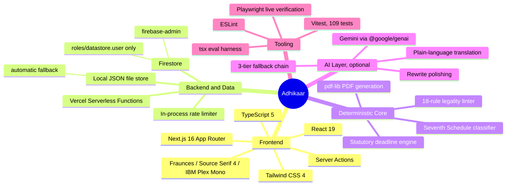
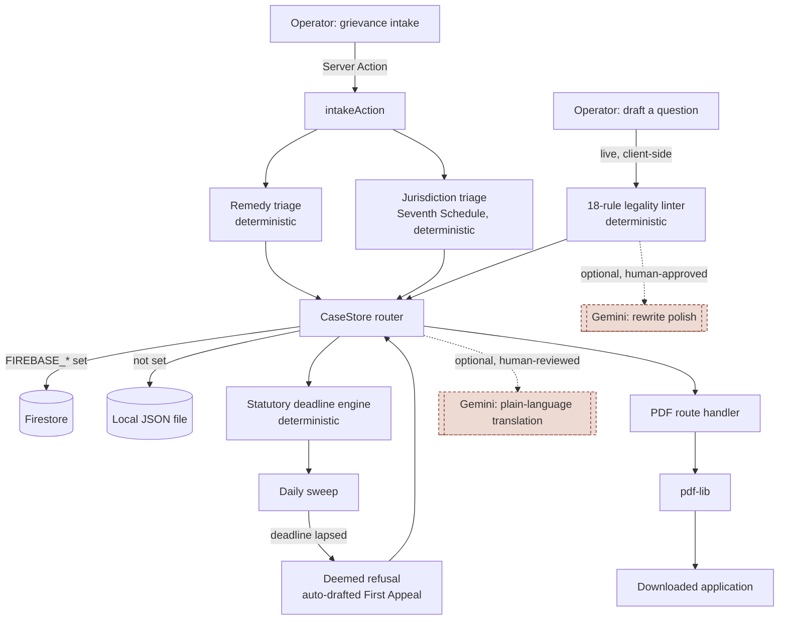
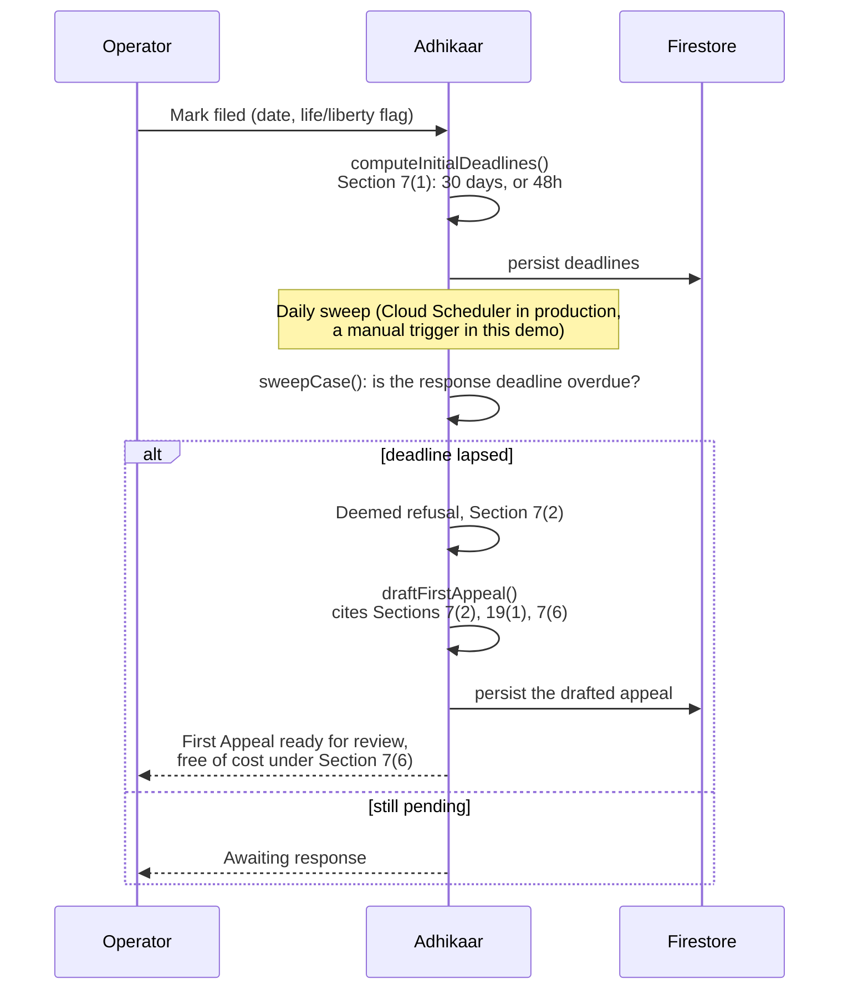
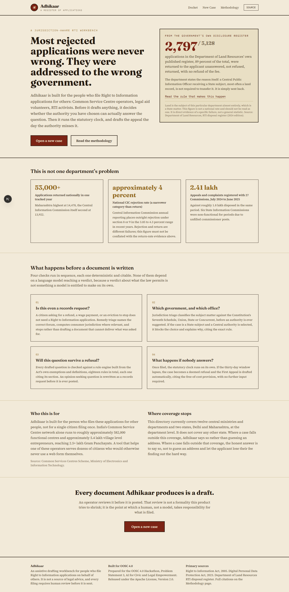
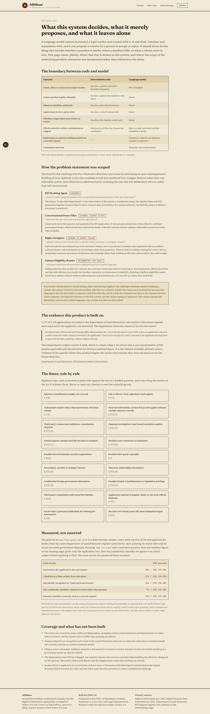
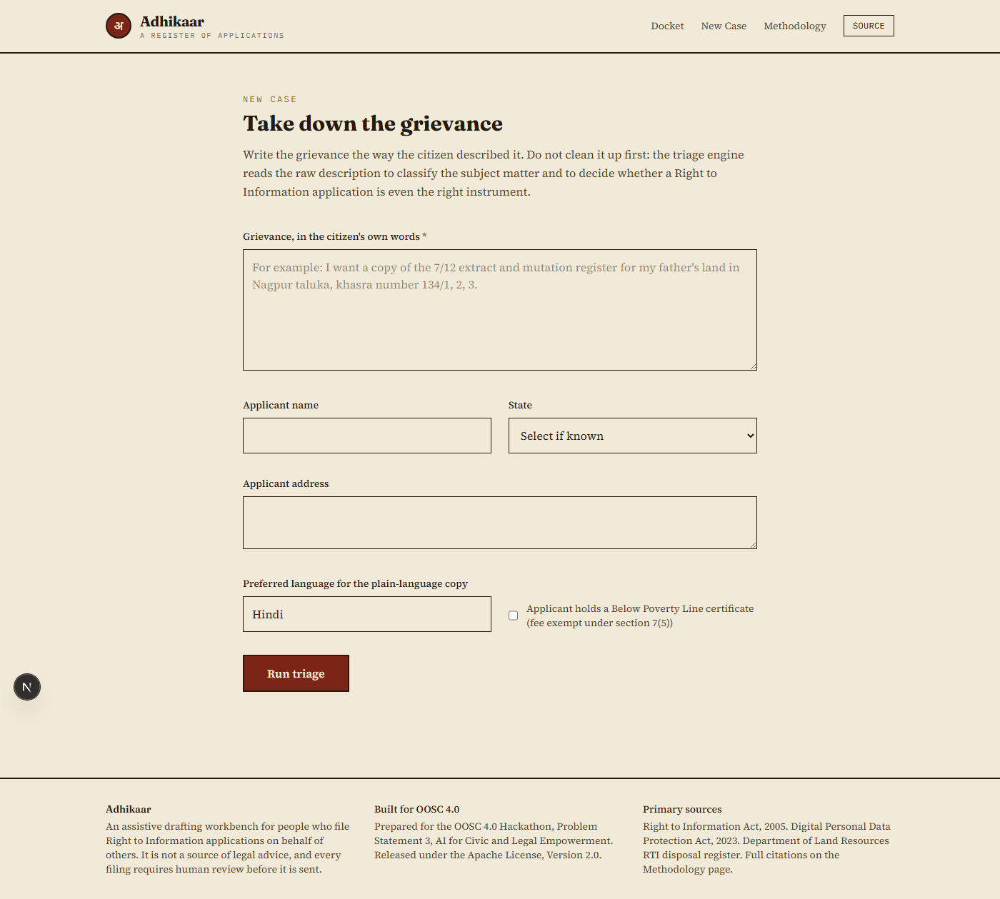
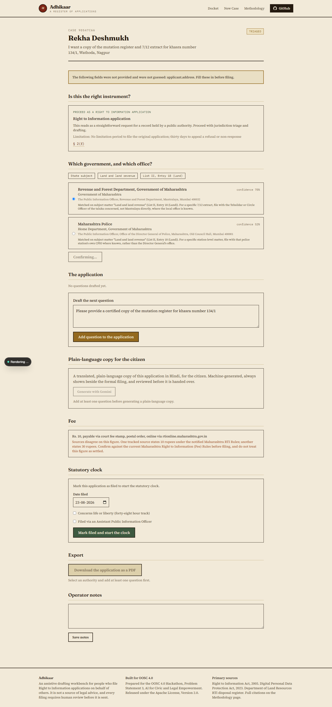

<div align="center">

# Adhikaar

*A jurisdiction-aware RTI casework workbench, built for the people who file on behalf of others.*

[](https://adhikaaroosc.vercel.app)
[](#-testing-and-evaluation)
[](LICENSE)

[](https://nextjs.org)
[](https://www.typescriptlang.org)
[](https://firebase.google.com/docs/firestore)
[](https://ai.google.dev)

[The claim](#-the-claim-this-is-built-on) &middot;
[The stack](#-a-map-of-the-stack) &middot;
[Architecture](#-architecture) &middot;
[The statutory clock](#-the-statutory-clock-visualised) &middot;
[Backend](#-backend-deep-dive) &middot;
[Screenshots](#-screenshots) &middot;
[Evaluation](#-testing-and-evaluation) &middot;
[Run it](#-running-it-locally)

</div>

---

## &#128220; The claim this is built on

The Department of Land Resources publishes its own register of RTI applications and how each one was disposed of, under section 4 of the Act. That register was downloaded and parsed in full: **3,128** uniquely numbered applications, **2,797** of them returned to the applicant, not answered, with no refund of the fee. The department states the reason itself, quoting a 2008 Office Memorandum: an application concerning a State subject, most often a land record, does not have to be transferred by a Central Public Information Officer. It is simply sent back.

That register belongs to a central land department, and land is almost entirely a State subject, so its return rate is not representative of RTI practice nationally and should never be quoted as one. It is the clearest primary source available for the specific failure this product targets: the section 6(3) transfer duty does not reach across the Union to State line, and an application addressed to the wrong level of government is a defect that can be caught before it is filed, not just diagnosed afterward.

> Everyone else writes the application. Adhikaar decides whether the authority you have chosen can lawfully answer it, before a document is produced, then runs the statutory clock and drafts the appeal the day the authority misses it.

Full sourcing, the national context figures, and the honesty caveat around the register live on the [Methodology](https://adhikaaroosc.vercel.app/methodology) page inside the running app.

---

## &#129504; A map of the stack

A mind map of every library actually in `package.json`, grouped by what it does in this codebase, not a generic marketing list.



---

## &#128268; Technology cards

Every card below is tied to a real file in this repository, not a generic "why we love this framework" blurb.

| Technology | Role here | Where |
| :--- | :--- | :--- |
| **Next.js 16 (App Router, Turbopack)** | Server Components for every read path, Server Actions for every mutation, one route handler for the binary PDF response | `src/app/`, `src/lib/actions.ts` |
| **React 19** | Client islands only where live feedback is needed: the question composer's inline linter, the citation popovers | `src/components/QuestionComposer.tsx`, `src/components/CitationTag.tsx` |
| **TypeScript 5** | A single `CaseRecord` shape shared by both storage backends, the PDF generator, the sweep engine and every UI surface, so a schema change is caught at compile time everywhere it matters | `src/lib/types.ts` |
| **Tailwind CSS 4** | A bookish, parchment-and-oxblood design system, sharp corners everywhere except the wax-seal brand mark, deliberately not blue and purple SaaS defaults | `src/app/globals.css` |
| **Firestore (`firebase-admin`)** | The production case store, used automatically once a service account is present in the environment, org-scoped, shared correctly across serverless instances | `src/lib/store/firestoreStore.ts` |
| **Local JSON file store** | The zero-setup fallback used when Firestore is not configured, so the product runs with no cloud account at all | `src/lib/store/fileStore.ts` |
| **`@google/genai` (Gemini)** | Strictly for the two things a model is allowed to do here: propose a rewrite, phrase a translation. It never decides jurisdiction, lints a question, or computes a deadline | `src/lib/gemini/client.ts` |
| **`pdf-lib`** | Builds the actual filed document server-side: applicant block, correctly addressed CPIO block, numbered questions, fee declaration, no template engine in between | `src/lib/pdf/generate.ts` |
| **Vitest** | 109 tests: every linter rule fixtured pass and fail, deadline arithmetic, the citation render gate, the full sweep-to-appeal pipeline, the Gemini fallback chain mocked at the SDK boundary | `src/**/*.test.ts` |
| **Vercel** | Hosts the live deployment; Firestore and Gemini credentials are set as encrypted project environment variables, never committed | `vercel.json` implicit, `README.md` deployment section below |

---

## &#127959;&#65039; Architecture

The real request flow, not an idealised one. The Gemini layer is drawn as a clearly separate, optional side-branch feeding only the translation and rewrite-polish features, because that separation is the whole point of the anti-wrapper doctrine on the Methodology page: **a model may propose and phrase, it may never adjudicate or compute.**



---

## &#9203; The statutory clock, visualised

The moneyshot flow, proven end to end against the live deployment, including an independent `curl` request that fetched a case from a completely different serverless instance than the one that created it, confirming the persistence actually works across instances, not just within one browser session.



---

## &#9881;&#65039; Backend deep-dive

**The `CaseStore` interface.** Every route, action and page imports persistence from exactly one place, `src/lib/store.ts`, which is a thin router over two interchangeable implementations behind a shared `CaseStore` interface (`src/lib/store/types.ts`):

- `src/lib/store/firestoreStore.ts`, used automatically once `FIREBASE_PROJECT_ID`, `FIREBASE_CLIENT_EMAIL` and `FIREBASE_PRIVATE_KEY` are present in the environment. This is what the live deployment runs on.
- `src/lib/store/fileStore.ts`, the zero-setup fallback. On Vercel it writes to `/tmp` rather than the read-only bundle directory, since only `/tmp` is writable at runtime there; locally it writes to `.data/cases.json`, gitignored since it can hold citizen personal information during testing.

The router pattern exists so the rest of the codebase never has to know which backend it is talking to, and so a production credential swap touches one file, not every call site.

**Cost safety, three independent layers.** The Firestore database backing the live URL was provisioned on Google Cloud's perpetual free tier, not a trial credit: 50,000 reads, 20,000 writes and 20,000 deletes a day, 1 GiB of storage, every day, for as long as the project exists.

1. **The free-tier ceiling itself.** Ordinary demo traffic never comes close.
2. **A GCP billing budget alert** on the dedicated project, firing at 1 cent, 50 cents and one dollar of spend.
3. **An in-process write rate limiter** (`src/lib/firestore/rateLimit.ts`, 30 writes per minute per instance, six of its own tests), a backstop against a bug or a scripted loop, not the primary control.

The service account itself holds only `roles/datastore.user` on a dedicated GCP project, unable to touch billing or create other resources even if the key were compromised.

**The Gemini layer, and its own fallback chain.** `generateWithFallback()` in `src/lib/gemini/client.ts` tries `gemini-3.7-flash`, then `gemini-3.6-flash`, then `gemini-2.5-flash`, moving to the next model on any request-level failure or an empty response, so one model being unavailable, renamed or deprecated cannot take a feature down. Building and testing this chain before switching models surfaced two real, external facts worth recording here rather than hiding: `gemini-2.5-flash` is now fully closed to new API keys (the API's own error names `gemini-3.6-flash` as the replacement), and separately, the newer models can return `429 RESOURCE_EXHAUSTED` on a project whose AI Studio prepayment credits are depleted, confirmed by calling the REST API directly rather than guessing from the SDK error alone. Neither AI feature is load-bearing: every decision that matters, jurisdiction, legality, deadlines, fees, citations, is deterministic code that was built and fully tested with zero Gemini access at all.

---

## &#128248; Screenshots

<table>
<tr>
<td width="50%">

**The landing page**, opening with the DoLR register evidence rather than a feature list.



</td>
<td width="50%">

**The Methodology page**, the anti-wrapper table and the scoping table stated in the open.



</td>
</tr>
<tr>
<td width="50%">

**Grievance intake**, the raw description goes straight to the triage engines, nothing cleaned up first.



</td>
<td width="50%">

**A populated case workspace** mid-sweep: jurisdiction triage, the legality linter with citations, the statutory clock, and the auto-drafted First Appeal, all on one page.



</td>
</tr>
</table>

---

## &#129513; Testing and evaluation

**109 automated tests**, `npm run test`: every one of the eighteen legality-linter rules gets a fixture that must fire it and one that must not, deadline arithmetic is checked to the day across month boundaries, the citation render gate is proven to throw on an unresolved citation rather than render an unsourced claim, the full sweep-to-deemed-refusal-to-appeal pipeline is exercised with real dates, PDF generation is checked for the actual `%PDF-` magic bytes, and the Gemini fallback chain is tested against a mocked SDK boundary for both the happy path and every fallback tier.

**A real evaluation harness**, `npm run eval`, measured against a 220-record gold set sampled deterministically from the same DoLR disclosure register cited above, each one a real citizen's application text paired with its actual government-recorded outcome:

| Measure | Result |
| :--- | :--- |
| Classified as a State subject from text alone | 131 / 220 (59.5%) |
| Specifically recognised as "Land and land revenue" | 124 / 220 (56.4%) |
| Not confidently classified, reported as such rather than guessed | 73 / 220 (33.2%) |
| Remedy classifier: correctly read as a records request | 219 / 220 (99.5%) |

Read the 56.4 percent plainly: on real, messy, first-person citizen writing, the classifier recognises just over half of these land queries by keyword and pattern alone, and says it does not know about roughly a third rather than guessing. Both numbers are published because a rule engine that only ever announces its successes is not trustworthy, and this one is asked to make legal-adjacent decisions.

---

## &#128640; Running it locally

```bash
npm install
npm run dev
```

Open `http://localhost:3000`. No cloud account, no API key, no setup beyond `npm install` is required: the jurisdiction engine, the legality linter, the deadline clock and PDF export are all deterministic code, and case data is stored in a local JSON file created automatically on first run.

```bash
npm run test    # 109 tests
npm run eval    # jurisdiction classifier measured against the 220-record DoLR gold set
npm run build   # production build
```

### Optional: Gemini-backed features

```bash
cp .env.example .env.local
```

Fill in `GEMINI_API_KEY` from [Google AI Studio](https://aistudio.google.com/apikey). The app tries `gemini-3.7-flash`, then `gemini-3.6-flash`, then `gemini-2.5-flash` automatically; `GEMINI_MODEL` is optional and, if set, is tried first, ahead of that built-in chain rather than in place of it. Without a key, both features show a clear inline message rather than failing silently, exactly the state the full automated test suite runs against.

### Optional: Firestore persistence

Set `FIREBASE_PROJECT_ID`, `FIREBASE_CLIENT_EMAIL` and `FIREBASE_PRIVATE_KEY` from a service account scoped to `roles/datastore.user` against your own Firestore database. Without these three set, the app falls back automatically to the local file store described above.

---

## &#127760; Deployed on Vercel

**Live at [adhikaaroosc.vercel.app](https://adhikaaroosc.vercel.app)**, backed by a real Firestore database, verified with an independent `curl` request that fetched a case from a different serverless instance than the one that created it. `src/lib/store.ts` selects Firestore automatically once the three `FIREBASE_*` variables are present as encrypted Vercel project environment variables, which is how the live deployment runs; local development uses the file fallback by default.

---

## &#9989; CI/CD

Two independent mechanisms, neither depending on the other:

- **Quality gate**: [`.github/workflows/ci.yml`](.github/workflows/ci.yml), GitHub Actions, runs on every push and every pull request into `master`. Lint, then the full Vitest suite, then a real `next build`, in that cheapest-first order, so a broken commit fails in seconds rather than minutes wherever possible. `master` has required-status-check branch protection: a pull request cannot merge while this check is red. Reproduce the exact gate locally with `npm run verify`.
- **Deploy**: Vercel's own Git integration, connected directly to this repository, builds and promotes to production independently on every push to `master`. There is deliberately no deploy step inside the GitHub Actions workflow; Vercel's managed build pipeline is the more reliable mechanism for that half of the job, and duplicating it would only add a second thing that could fail.

Both halves were verified against a real failure, not assumed. The first version of the CI workflow included a standalone `tsc --noEmit` step that passed on every local run but failed on the very first real run against a clean GitHub Actions checkout, because Next.js generates ambient route types (like `LayoutProps`) as a side effect of `next build`/`next dev`, and a fresh checkout has no such artifact yet; `next build` performs the same check afterward with the generated types actually present, so the redundant, environment-dependent step was removed rather than worked around. Separately, a throwaway branch with a deliberately failing test assertion was pushed and confirmed to fail the pipeline for real (the Build step correctly never ran once Test failed), then deleted.

---

## &#129504; What this system decides, what it merely proposes

| Concern | Deterministic code | Language model |
| :--- | :--- | :--- |
| Union, State or Concurrent subject matter | Decides, against a Seventh Schedule mapping | Not consulted |
| Is this question legally refusable | Decides, against the eighteen-rule linter | Never |
| Statutory deadline arithmetic | Decides, pure date functions | Never |
| Application fee for a given state | Decides, a cited lookup table | Never |
| Whether a legal claim may render on screen | Decides, the citation render gate | Never |
| Which authority within a jurisdiction to suggest | Retrieval and filtering choose the candidates | May re-rank, and must cite the candidate it picks |
| A more natural phrasing of a mechanical rewrite | Sets the boundary the rewrite must stay inside | Optional, shown beside the mechanical version, applied only if an operator accepts it |
| Plain-language translation for the citizen | Supplies the questions verbatim; the model may not add, drop or reinterpret any of them | Optional, always shown beside the formal English filing |

The rule, stated plainly: a model may propose and phrase. It may never adjudicate or compute. The full reasoning, including how each of the problem statement's four illustrative directions was scoped, and the one left deliberately unbuilt, is on the [Methodology](https://adhikaaroosc.vercel.app/methodology) page.

---

## &#128203; What is covered, and what is not

Two states are covered by name in the authority directory, Delhi and Maharashtra, alongside twelve central ministries and departments. No other state is covered, and the system says so in the interface rather than guessing an address. Tenancy disputes are recognised and routed to the correct forum by name, but no state rent authority is covered in depth, since tenancy law has no uniform national statute. Filing is never automated: Adhikaar prepares a document for a human to review and post, it does not submit anything to a government portal on anyone's behalf.

This is an assistive drafting tool, not a source of legal advice, and every document it produces requires human review before it is filed.

---

## &#128220; License

Apache License, Version 2.0. See [`LICENSE`](LICENSE).

<div align="center">

*Not built to look busy. Built to be right before it is filed.*

</div>
